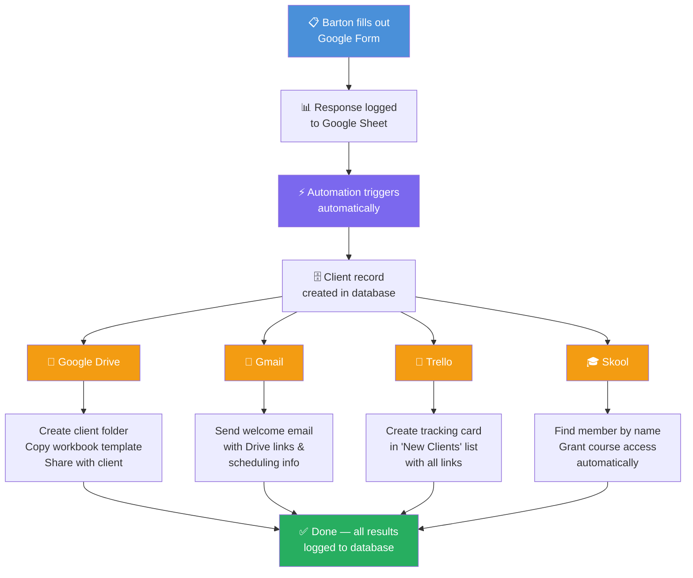

# Fractional Client Onboarding — Executive Summary

**The Problem**
Every time Barton confirms a new fractional advisory client, he spends ~10 minutes on four manual tasks: creating a Google Drive workspace, sending a welcome email, creating a Trello tracking card, and granting Skool course access.

**The Solution**
A single Google Form submission triggers a fully automated pipeline that completes all four tasks in seconds — no manual steps required.

---

## How It Works

1. **Barton fills out one form** with the client's name, email, start date, and any notes.

2. **Instantly and automatically:**
   - A Google Drive folder and workbook are created, named after the client, and shared with them
   - A personalized welcome email is sent with their workspace links and scheduling information
   - A Trello card appears in the "New Clients" pipeline with all relevant links
   - The client's Skool account is found and granted access to the Fractional Advisory course

3. **Everything is logged** — a database record tracks each client and the status of every automation step.

---

## Reliability

Each step is independent. If one fails (e.g., Skool can't find the member by name), the others still complete. Failures surface as alerts so Barton can handle the edge case manually without losing the other automations.

---

## Rollout

The system ships in five incremental phases, each independently useful:

| Phase | What ships |
|---|---|
| 1 | Pipeline plumbing and database logging |
| 2 | Drive folder creation |
| 3 | Welcome email |
| 4 | Trello card |
| 5 | Skool course access |

---

## Dual Value

This automation runs Barton's own practice *and* becomes the product he delivers to fractional advisory clients who want the same system for their businesses.
